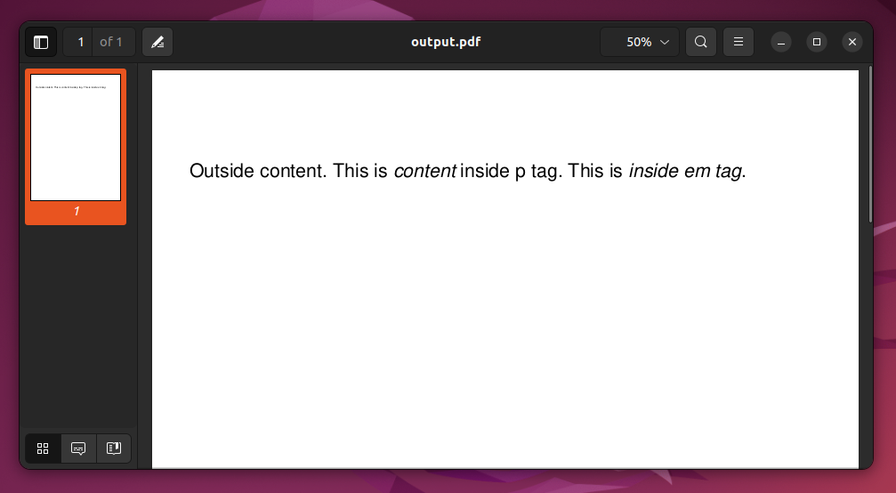

#FPDF

http://www.fpdf.org/

## F for Free

FPDF is a PHP class which allows to generate PDF files with pure PHP, that is to say without using the PDFlib library. F from FPDF stands for Free: you may use it for any kind of usage and modify it to suit your needs.

# Namespaces and Autoloading 

http://berlinonline.github.io/php-introduction/chapters/namespaces_and_autoloading/

https://www.daggerhartlab.com/autoloading-namespaces-in-php/

https://code.tutsplus.com/tutorials/how-to-autoload-classes-with-composer-in-php--cms-35649